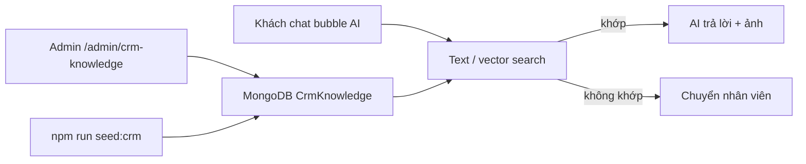

# Hướng dẫn cung cấp dữ liệu cho AI tư vấn BĐS

Thông tin cho AI **không gõ trực tiếp vào chat**. Bạn đăng vào **kho CRM AI** (MongoDB collection `CrmKnowledge`). Hệ thống tìm bài khớp với câu hỏi khách, sau đó AI trả lời theo đúng dữ liệu đó.

---

## Cách 1: Trang Admin (khuyên dùng)

1. Đăng nhập **tài khoản admin**
2. Vào **http://localhost:5173/admin/crm-knowledge**  
   (menu sidebar: **CRM AI**)
3. Điền form **Tạo bài mới**:

| Trường | Ví dụ | Ghi chú |
|--------|--------|---------|
| **Tiêu đề** | `Căn 2PN Quận 2 view sông` | Khách hay hỏi theo từ này |
| **Mô tả** | Full nội thất, 65m², gần Metro... | AI chỉ được trả lời theo nội dung này |
| **Giá** | `12000000` | VNĐ/tháng |
| **Địa chỉ** | `123 Nguyễn Văn Linh` | |
| **Quận/Huyện** | `Quận 2` | Rất quan trọng để khớp câu hỏi |
| **Phòng ngủ / Diện tích** | `2` / `65` | |
| **Ảnh** | upload | Hiện trong bubble chat (cần Cloudinary đúng `.env`) |
| **Trạng thái** | `active` | Chỉ bài `active` mới được AI tìm |

4. Bấm **Đăng bài** → lưu DB + (nếu có credit OpenRouter) tạo embedding.

**Ví dụ sau khi đăng:** khách chat *"căn 2 phòng Quận 2 giá bao nhiêu"* → AI tìm bài khớp → trả lời + ảnh.

---

## Cách 2: Seed nhanh (dev)

Trong thư mục API:

```bash
cd real-estate-project-api
npm run seed:crm
```

Script tạo sẵn 2 bài mẫu (Quận 2, Quận 1). Chỉnh thêm trong [`scripts/seed-crm-knowledge.js`](../scripts/seed-crm-knowledge.js) nếu muốn.

---

## Cách 3: API (tích hợp khác)

- **Endpoint:** `POST /api/crm-knowledge`
- **Auth:** JWT admin (`Authorization: Bearer <token>`)

Payload ví dụ:

```json
{
  "tieuDe": "Căn 2PN Quận 2 view sông",
  "moTa": "Full nội thất, 65m2, gần Metro",
  "gia": 12000000,
  "diaChi": "123 Nguyễn Văn Linh",
  "quanHuyen": "Quận 2",
  "phongNgu": 2,
  "dienTich": 65,
  "loaiBds": "can_ho",
  "anhUrls": [],
  "trangThai": "active"
}
```

---

## Luồng dữ liệu



---

## Lưu ý quan trọng

1. **DB trống = handoff ngay** — log `score=0.000` nghĩa là không có bài CRM khớp; AI chưa gọi model chat.
2. **Viết từ khóa khách hay dùng** trong tiêu đề, mô tả, quận/huyện (vd. `Quận 2`, `2 phòng`, `căn hộ`).
3. **Embedding OpenRouter cần credit** — nếu không có credit, hệ thống dùng **text search** (khớp từ khóa). Càng nhiều từ trùng câu hỏi → score cao hơn → AI mới trả lời.
4. **Ngưỡng khớp:** vector `0.6`, text search `0.3` (cấu hình trong `.env`: `VECTOR_SIMILARITY_THRESHOLD`, `VECTOR_TEXT_SEARCH_THRESHOLD`).
5. **Cloudinary lỗi** (`cloud_name mismatch`) → vẫn đăng bài được; chỉ upload ảnh có thể fail. Sửa `CLOUDINARY_*` trong `.env` nếu cần hiển thị ảnh trong chat.

---

## Liên quan

- Vector index Atlas: [CRM_VECTOR_INDEX.md](./CRM_VECTOR_INDEX.md)
- API CRM: `routes/crmKnowledge.js`, `controllers/crmKnowledgeController.js`
- Pipeline AI: `services/aiAdvisoryPipeline.js`
