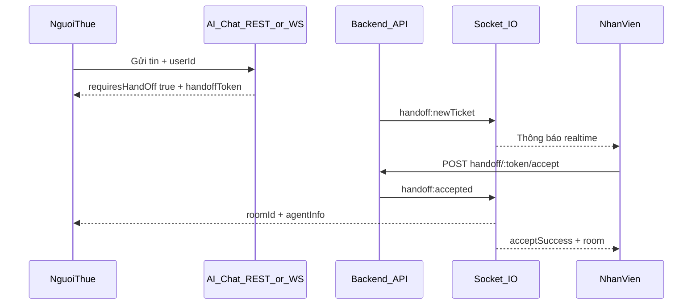

# Prompt tích hợp Frontend — AI Chat Handoff

Tài liệu này mô tả cách frontend tích hợp luồng: **Người thuê chat AI → Handoff ticket → Thông báo realtime tới nhân viên → Nhân viên nhận → Phòng chat riêng**.

## Tổng quan luồng



**Base URL backend:** `http://localhost:8000`  
**Prefix API:** `/api`  
**Socket.IO:** `http://localhost:8000` (auth JWT)  
**AI WebSocket:** `ws://localhost:8000/ws` (hoặc proxy Vite `ws://localhost:5173/ws`)

---

## Vai trò và điều kiện

| Vai trò | Làm gì |
|---------|--------|
| `nguoi_thue` (vd: tien tho, `_id: 6a390199120aeb86eb2073df`) | Chat AI, gửi kèm `userId`, chờ nhân viên |
| `nhan_vien` (vd: Trinh Ngoc) | Kết nối Socket.IO, nhận thông báo ticket, accept |

**Bắt buộc:** Request handoff phải có `userId` (hoặc `id`) của người thuê. `sessionId` tự tạo nếu không gửi.

---

## PHẦN 1 — Người thuê (`nguoi_thue`)

### Cách A: REST API (khuyến nghị)

**Bước 1 — Chat AI**

```
POST /api/ai-chat/message
Content-Type: application/json
```

```json
{
  "message": "Tôi muốn thương lượng giá thuê",
  "sessionId": "session_1719030000000",
  "userId": "6a390199120aeb86eb2073df",
  "customerName": "tien tho",
  "conversationHistory": [
    { "role": "user", "message": "Studio Quận 7 dưới 8 triệu" },
    { "role": "ai", "message": "Có 1 căn phù hợp..." }
  ]
}
```

**Response khi AI không xử lý được (tự tạo ticket + notify nhan_vien):**

```json
{
  "success": true,
  "requiresHandOff": true,
  "sessionId": "session_1719030000000",
  "intent": "HANDOFF",
  "handOffMessage": "Tôi sẽ kết nối bạn với nhân viên...",
  "handoffToken": "handoff_session_1719030000000_1782120053513",
  "ticketId": "6a38fe...",
  "status": "pending"
}
```

**Bước 2 — (Tuỳ chọn) Tạo ticket thủ công nếu chưa có handoffToken**

```
POST /api/ai-chat/handoff
```

```json
{
  "sessionId": "session_1719030000000",
  "userId": "6a390199120aeb86eb2073df",
  "reason": "Khách muốn thương lượng giá",
  "conversationHistory": []
}
```

**Bước 3 — Chờ nhân viên (poll hoặc socket)**

```
GET /api/ai-chat/handoff/{handoffToken}/status
```

Poll mỗi 3–5 giây cho đến khi `status === "active"`:

```json
{
  "success": true,
  "handoffToken": "handoff_...",
  "status": "active",
  "agentInfo": {
    "agentId": "6a38fafec407c6b22a90ed0b",
    "agentName": "Trinh Ngoc",
    "avatar": ""
  },
  "roomId": "6a38fe7690183e2f4d6352ef"
}
```

**Bước 4 — Kết nối Socket.IO để nhận realtime (khuyến nghị thay poll)**

Xem file mẫu: [docs/examples/tenant-handoff.client.js](./examples/tenant-handoff.client.js)

```js
import { io } from 'socket.io-client';

const socket = io('http://localhost:8000', {
  auth: { token: accessToken },
  transports: ['websocket'],
});

socket.emit('handoff:join', { handoffToken });

socket.on('handoff:accepted', (data) => {
  navigateToChatRoom(data.room._id);
});
```

### Cách B: AI WebSocket

```js
const ws = new WebSocket('ws://localhost:8000/ws');

ws.onmessage = (e) => {
  const msg = JSON.parse(e.data);
  if (msg.type === 'ready') {
    ws.send(JSON.stringify({
      message: 'Tôi muốn thương lượng giá',
      sessionId: 'session_xxx',
      userId: '6a390199120aeb86eb2073df',
      customerName: 'tien tho'
    }));
  }
  if (msg.type === 'handoff') {
    // msg.handoffToken → emit handoff:join qua Socket.IO
  }
};
```

---

## PHẦN 2 — Nhân viên (`nhan_vien`)

Xem file mẫu: [docs/examples/agent-handoff.client.js](./examples/agent-handoff.client.js)

### Kết nối Socket.IO (bắt buộc để nhận realtime)

```js
const socket = io('http://localhost:8000', {
  auth: { token: accessToken },
  transports: ['websocket'],
});

socket.on('handoff:pendingList', ({ tickets }) => renderTicketList(tickets));
socket.on('handoff:newTicket', ({ ticket }) => showNotification(ticket));
socket.on('handoff:ticketRemoved', ({ handoffToken }) => removeTicketFromList(handoffToken));
socket.on('newNotification', (n) => {
  if (n.loai === 'handoff_ticket') showBellNotification(n);
});
```

### Nhận ticket — Socket

```js
socket.emit('handoff:accept', { handoffToken });
socket.once('handoff:acceptSuccess', (data) => navigateToChatRoom(data.room._id));
```

### Nhận ticket — REST

```
POST /api/ai-chat/handoff/{handoffToken}/accept
Headers: { token: <JWT_nhan_vien> }
```

### Lấy danh sách ticket chờ

```
GET /api/ai-chat/handoff/pending
Headers: { token: <JWT_nhan_vien> }
```

---

## PHẦN 3 — Chat sau khi nhận ticket

```js
socket.emit('joinRoom', roomId);
socket.on('message:new', (message) => { /* render */ });
socket.emit('message:create', { roomId, noiDung: 'Xin chào!' });
```

---

## Bảng endpoint

| Method | Endpoint | Auth | Ai gọi |
|--------|----------|------|--------|
| POST | `/api/ai-chat/message` | Không | Người thuê |
| POST | `/api/ai-chat/handoff` | Không | Người thuê |
| GET | `/api/ai-chat/handoff/:token/status` | Không | Người thuê |
| GET | `/api/ai-chat/handoff/pending` | JWT | Nhân viên |
| POST | `/api/ai-chat/handoff/:token/accept` | JWT | Nhân viên |

**Header auth:** `token: <JWT>` hoặc `Authorization: Bearer <JWT>`

---

## Socket events

| Event | Hướng | Mô tả |
|-------|-------|-------|
| `handoff:pendingList` | Server → NV | Danh sách ticket chờ |
| `handoff:newTicket` | Server → NV | Ticket mới |
| `handoff:ticketRemoved` | Server → NV | Ticket đã được nhận |
| `handoff:notificationRemoved` | Server → NV | Xóa thông báo bell |
| `handoff:accept` | NV → Server | Nhân viên nhận ticket |
| `handoff:acceptSuccess` | Server → NV | Nhận thành công + room |
| `handoff:join` | Khách → Server | Join room chờ |
| `handoff:accepted` | Server → Khách | Nhân viên đã vào + roomId |
| `newNotification` | Server → User | Thông báo DB (`handoff_ticket`) |

---

## Checklist FE

- [ ] Người thuê gửi `userId` trong mọi request AI/handoff
- [ ] Nhân viên connect Socket.IO ngay sau login (role `nhan_vien`)
- [ ] UI hiển thị popup/bell khi `handoff:newTicket`
- [ ] Nút "Nhận" gọi `handoff:accept` hoặc REST accept
- [ ] Xóa ticket khỏi list khi `handoff:ticketRemoved`
- [ ] Người thuê `handoff:join` + listen `handoff:accepted` → redirect chat room
- [ ] Vite proxy `/ws` và `/api` về `localhost:8000` nếu dev port 5173

---

## Vite proxy (dev)

```js
// vite.config.js
export default {
  server: {
    proxy: {
      '/api': { target: 'http://localhost:8000' },
      '/ws': { target: 'ws://localhost:8000', ws: true },
    },
  },
};
```

---

## Test nhanh (curl)

```bash
curl -X POST http://localhost:8000/api/ai-chat/handoff \
  -H "Content-Type: application/json" \
  -d '{"sessionId":"test","userId":"6a390199120aeb86eb2073df","reason":"Thương lượng giá"}'

curl -X POST http://localhost:8000/api/ai-chat/handoff/HANDOFF_TOKEN/accept \
  -H "token: JWT_NHAN_VIEN"
```

---

## Lưu ý

1. Không có endpoint riêng chỉ "gửi thông báo" — thông báo tự động khi tạo ticket qua `/handoff` hoặc `/message` với `requiresHandOff` + `userId`.
2. Backend query user `vaiTro.ten === "nhan_vien"` và `trangThai === "hoat_dong"`.
3. Khi 1 nhân viên accept, thông báo tự xóa ở nhân viên khác qua `handoff:ticketRemoved`.
4. Phòng chat tạo ra là `loaiPhong: "private"` (khách + nhân viên).
